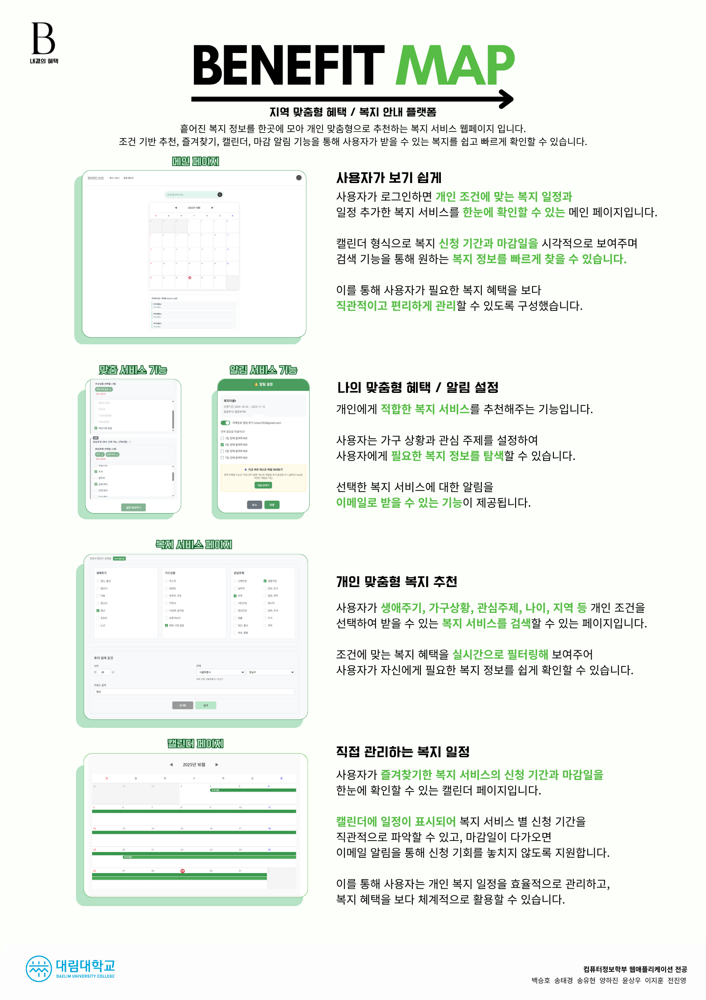
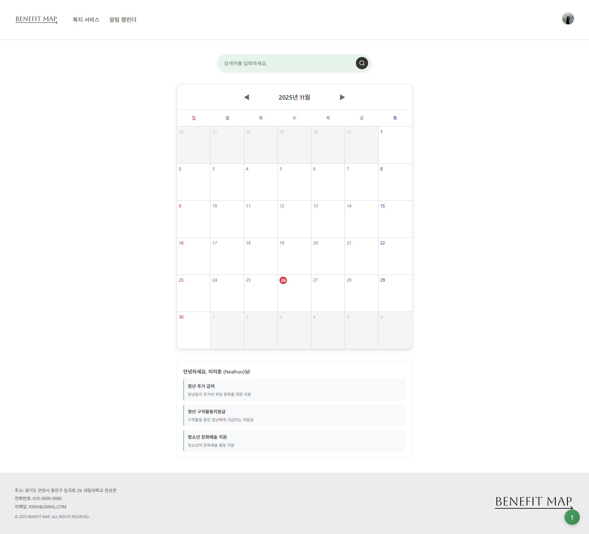
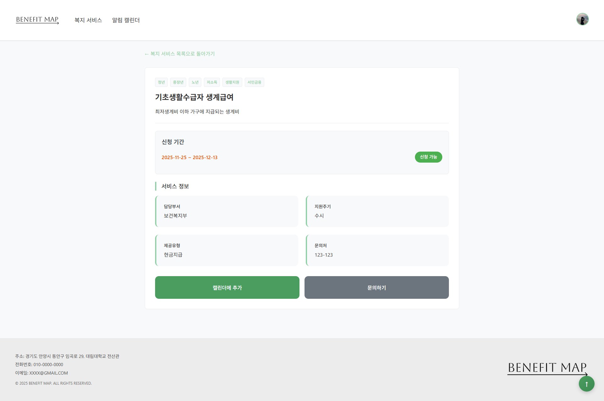
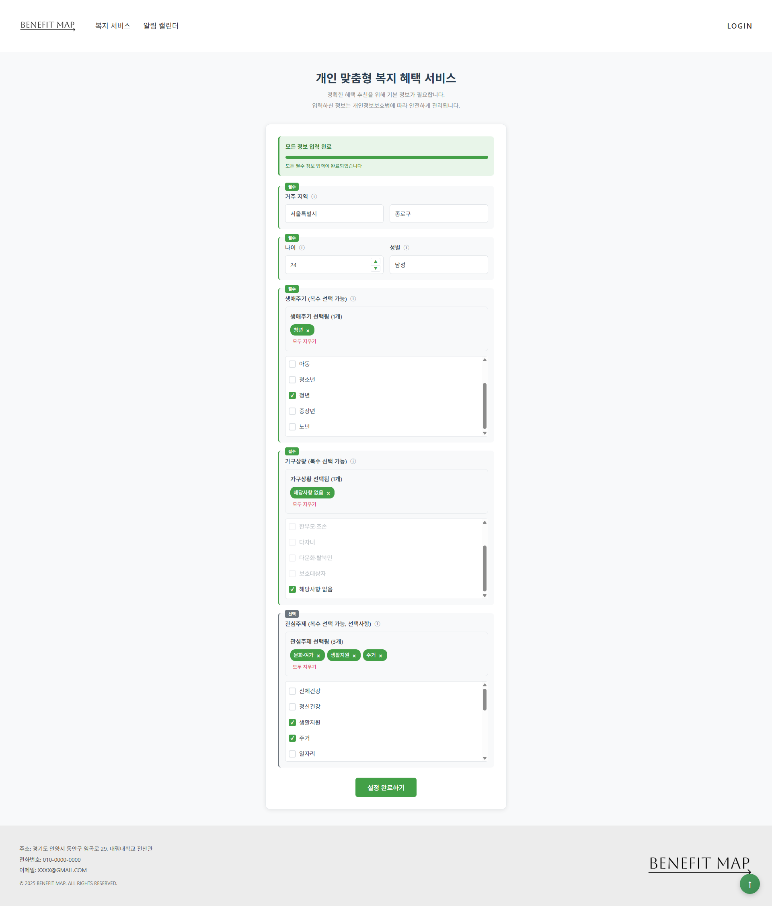
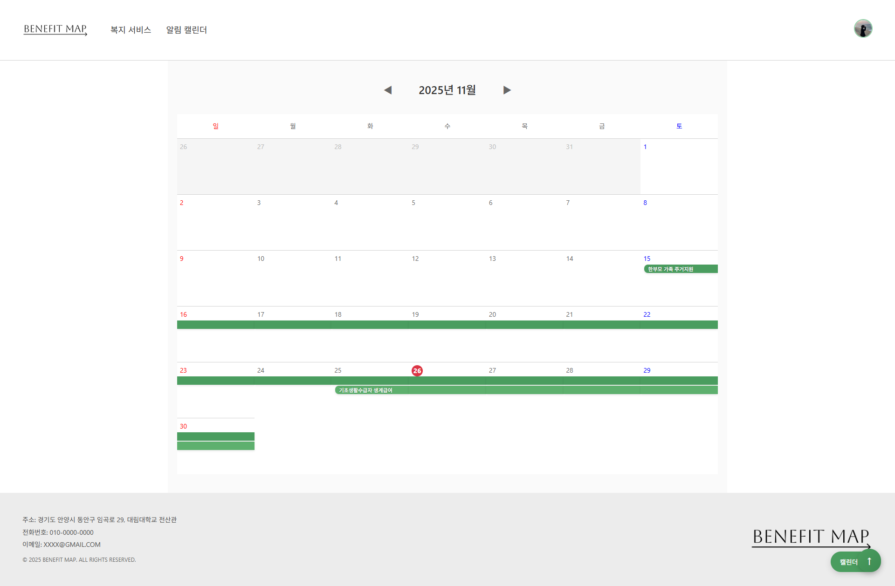
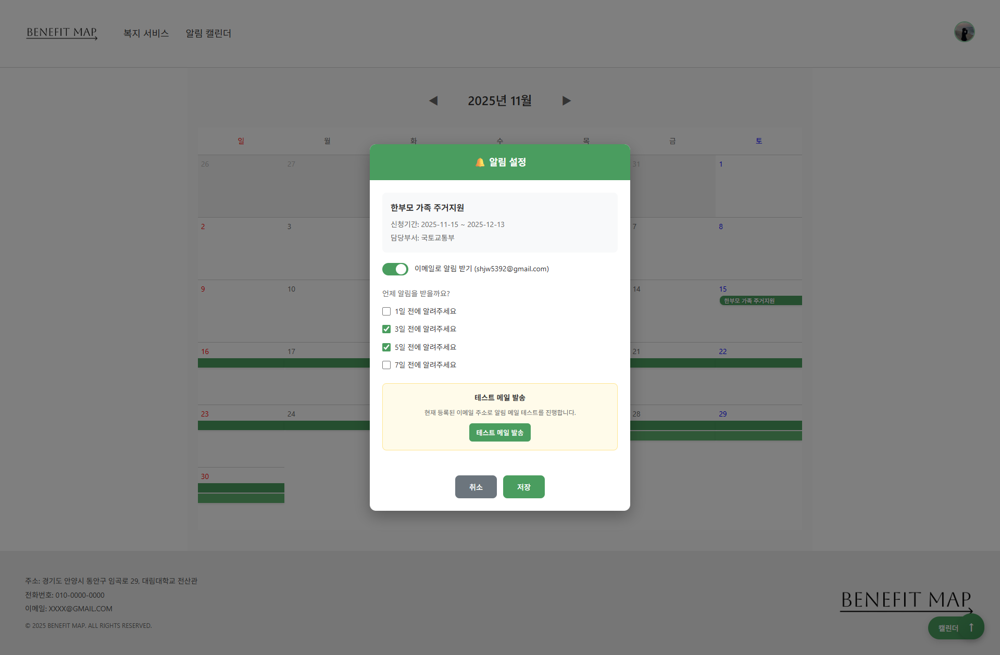

# BenefitMap

정부 및 지자체 복지 서비스를 통합하여 개인 맞춤형 복지 정보를 제공하는 웹 애플리케이션입니다.



## 목차

- [프로젝트 소개](#프로젝트-소개)
- [주요 기능](#주요-기능)
- [기술 스택](#기술-스택)
- [시작하기](#시작하기)
- [스크린샷](#스크린샷)
- [프로젝트 구조](#프로젝트-구조)
- [API 문서](#api-문서)
- [개발 환경 설정](#개발-환경-설정)
- [배포](#배포)
- [문제 해결](#문제-해결)

## 프로젝트 소개

BenefitMap은 사용자의 지역, 성별, 나이, 가구 상황, 관심 주제 등을 기반으로 받을 수 있는 복지 서비스를 추천하고, 신청 기간을 관리할 수 있는 통합 플랫폼입니다.

### 핵심 가치

- **개인 맞춤형 추천**: 사용자 프로필 기반 복지 서비스 자동 필터링
- **통합 검색**: 중앙부처, 지자체, 민간 복지 서비스를 한 곳에서 검색
- **일정 관리**: 복지 서비스 신청 기간을 캘린더로 관리
- **알림 서비스**: 마감일 3일 전 이메일 알림

## 주요 기능

### 1. 복지 서비스 검색 및 필터링

- 키워드 기반 실시간 검색
- 다중 필터 지원 (생애주기, 가구상황, 관심주제)
- 지역별 검색 (시/도, 시/군/구)
- 정렬 기능 (인기순, 최신순)

### 2. 개인 맞춤형 추천

- 회원 가입 시 입력한 정보 기반 자동 추천
- 온보딩 프로세스를 통한 사용자 프로필 설정
- 태그 기반 서비스 매칭

### 3. 즐겨찾기 및 캘린더

- 관심 있는 복지 서비스 즐겨찾기
- 캘린더에 신청 기간 자동 추가
- 월별 일정 관리 및 시각화

### 4. 알림 시스템

- 즐겨찾기한 서비스 마감일 3일 전 이메일 알림
- 이메일 알림 설정 관리
- Gmail SMTP를 통한 알림 발송

### 5. 사용자 인증 및 프로필 관리

- Google OAuth2 소셜 로그인
- JWT 기반 인증 시스템
- 사용자 프로필 및 설정 관리

## 기술 스택

### Frontend

- **React 19.1.1** - UI 라이브러리
- **Vite 7.1.6** - 빌드 도구 및 개발 서버
- **React Router DOM 6.30.1** - 클라이언트 사이드 라우팅
- **Styled Components 6.1.19** - CSS-in-JS 스타일링

### Backend

- **Spring Boot 3.5.5** - 웹 프레임워크
- **Java 21** - 프로그래밍 언어
- **Spring Security** - 인증 및 인가
- **Spring Data JPA** - 데이터 접근 계층
- **MySQL 8.0** - 관계형 데이터베이스
- **JWT** - 토큰 기반 인증
- **OAuth2** - 소셜 로그인

### Infrastructure & Tools

- **Gradle** - 빌드 도구
- **npm** - 패키지 관리
- **Swagger/OpenAPI** - API 문서화

## 시작하기

### 필수 요구사항

- Node.js 18 이상
- Java 21
- MySQL 8.0 이상

### 설치 및 실행

#### 1. 저장소 클론

```bash
git clone https://github.com/your-username/BenefitMap.git
cd BenefitMap
```

> **참고**: 위 URL은 실제 저장소 URL로 변경해주세요.

#### 2. MySQL 데이터베이스 설정

```bash
# MySQL 서버 실행
net start MySQL80  # Windows
# 또는
brew services start mysql  # macOS
sudo systemctl start mysql  # Linux

# MySQL 접속
mysql -u root -p
```

```sql
-- 데이터베이스 생성
CREATE DATABASE IF NOT EXISTS benefitmap 
  CHARACTER SET utf8mb4 COLLATE utf8mb4_0900_ai_ci;

USE benefitmap;

-- 스키마 적용
SOURCE BenefitMapBackend/src/main/resources/db/migration/V1__auth.sql;
-- 또는 [V1__auth.sql](BenefitMapBackend/src/main/resources/db/migration/V1__auth.sql) 파일을 직접 열어서 내용 복사
```

#### 3. 환경변수 설정

프로젝트 루트(`BenefitMap/.env`)에 `.env` 파일을 생성하고 다음 내용을 작성하세요:

```env
# 데이터베이스 설정
DB_USERNAME=root
DB_PASSWORD=your_mysql_password

# JWT 토큰 설정
JWT_SECRET=your-secret-key-minimum-32-characters-long
JWT_ACCESS_EXP=3600
JWT_REFRESH_EXP=1209600

# Google OAuth2 설정
GOOGLE_CLIENT_ID=your-google-client-id
GOOGLE_CLIENT_SECRET=your-google-client-secret

# CORS 설정
CORS_ORIGINS=http://localhost:5173

# 이메일 설정 (Gmail SMTP)
MAIL_USERNAME=your-email@gmail.com
MAIL_PASSWORD=your-app-password
```

#### 4. 의존성 설치 및 실행

```bash
# 의존성 설치
npm install

# 개발 서버 실행 (백엔드 + 프론트엔드)
npm run dev
```

#### 5. 접속

- **프론트엔드**: http://localhost:5173
- **백엔드 API**: http://localhost:8080
- **API 문서**: http://localhost:8080/swagger-ui.html

## 스크린샷

### 메인 페이지


### 서비스 검색 페이지


### 개인 맞춤형 복지 서비스 페이지


### 캘린더 페이지


### 알림 설정 페이지


## 프로젝트 구조

```
BenefitMap/
├── BenefitMapFrontend/          # React 프론트엔드
│   ├── src/
│   │   ├── components/          # 재사용 가능한 컴포넌트
│   │   ├── screens/             # 페이지 컴포넌트
│   │   ├── hooks/               # 커스텀 훅
│   │   ├── utils/               # 유틸리티 함수
│   │   └── styles/              # 스타일 관련
│   ├── public/                  # 정적 파일
│   ├── package.json
│   └── vite.config.js
│
├── BenefitMapBackend/           # Spring Boot 백엔드
│   ├── src/main/java/
│   │   └── com/benefitmap/backend/
│   │       ├── auth/            # 인증 관련
│   │       ├── user/            # 사용자 관리
│   │       ├── catalog/         # 복지 서비스 카탈로그
│   │       ├── calendar/        # 캘린더 기능
│   │       ├── mail/           # 이메일 알림
│   │       ├── tag/            # 태그 관리
│   │       ├── onboarding/     # 온보딩
│   │       └── config/         # 설정
│   ├── src/main/resources/
│   │   ├── application.properties
│   │   ├── db/migration/        # 데이터베이스 마이그레이션
│   │   └── catalog/
│   ├── build.gradle
│   └── settings.gradle
│
├── .env                         # 환경변수 (루트)
└── package.json                 # 루트 설정
```

## API 문서

프로젝트 실행 후 다음 주소에서 API 문서를 확인할 수 있습니다:

- **Swagger UI**: http://localhost:8080/swagger-ui.html
- **OpenAPI JSON**: http://localhost:8080/v3/api-docs

### 주요 API 엔드포인트

#### 인증
- `POST /oauth2/authorization/google` - Google OAuth2 로그인
- `POST /auth/logout` - 로그아웃
- `POST /auth/refresh` - 토큰 갱신

#### 사용자
- `GET /user/me` - 내 정보 조회
- `PATCH /user/me` - 내 정보 수정
- `DELETE /user/me` - 회원 탈퇴

#### 복지 서비스
- `GET /api/catalog/search` - 복지 서비스 검색
- `GET /api/catalog/{id}` - 복지 서비스 상세 조회

#### 캘린더
- `GET /api/calendar` - 캘린더 일정 조회
- `POST /api/calendar` - 캘린더 일정 추가
- `DELETE /api/calendar/{id}` - 캘린더 일정 삭제

## 개발 환경 설정

### IDE 설정

#### VS Code

1. VS Code에서 프로젝트 폴더 열기
2. 터미널에서 `npm install` 실행
3. `npm run dev`로 개발 서버 실행

#### IntelliJ IDEA

1. IntelliJ에서 프로젝트 폴더 열기
2. Gradle 프로젝트로 인식되면 자동 동기화
3. 터미널에서 `npm install` 및 `npm run dev` 실행

### 환경변수 설정 가이드

#### Google OAuth2 설정

1. [Google Cloud Console](https://console.cloud.google.com/) 접속
2. 새 프로젝트 생성 또는 기존 프로젝트 선택
3. API 및 서비스 > 사용자 인증 정보 > OAuth 2.0 클라이언트 ID 만들기
4. 승인된 리디렉션 URI에 `http://localhost:8080/login/oauth2/code/google` 추가
5. 생성된 클라이언트 ID와 시크릿을 프로젝트 루트의 `.env` 파일에 입력

#### Gmail SMTP 설정

1. Google 계정 설정 > 보안 > 2단계 인증 활성화
2. 앱 비밀번호 생성
3. 생성된 비밀번호를 프로젝트 루트의 `.env` 파일의 `MAIL_PASSWORD`에 입력

## 배포

### 프로덕션 빌드

```bash
# 프론트엔드 빌드
cd BenefitMapFrontend
npm run build

# 백엔드 빌드
cd BenefitMapBackend
./gradlew build
```

### 환경변수 설정 (프로덕션)

프로덕션 환경에서는 다음 설정을 변경해야 합니다:

```env
# HTTPS 환경
app.cookie.secure=true

# CORS 설정
CORS_ORIGINS=https://yourdomain.com

# 프로덕션 데이터베이스 설정
spring.datasource.url=jdbc:mysql://your-db-host:3306/benefitmap
```

## 문제 해결

### MySQL 연결 오류

```bash
# MySQL 서버 실행 확인
net start MySQL80  # Windows

# 데이터베이스 및 사용자 확인
mysql -u root -p -e "SHOW DATABASES;"
```

### 포트 충돌

```bash
# 포트 사용 중인 프로세스 확인
netstat -ano | findstr ":8080"  # Windows
lsof -i :8080  # macOS/Linux

# 프로세스 종료
taskkill /PID <PID> /F  # Windows
kill -9 <PID>  # macOS/Linux
```

### 의존성 설치 오류

```bash
# 캐시 삭제 후 재설치
npm cache clean --force
rm -rf node_modules package-lock.json
npm install
```

## 라이센스

이 프로젝트는 MIT 라이센스 하에 있습니다.

## 기여

이슈 및 풀 리스트를 환영합니다. 프로젝트에 기여하기 전에 먼저 이슈를 열어 변경 사항에 대해 논의해 주세요.

## 연락처

프로젝트 관련 문의사항이 있으시면 이슈를 등록해 주세요.

---

**BenefitMap** - 복지 서비스 통합 플랫폼
